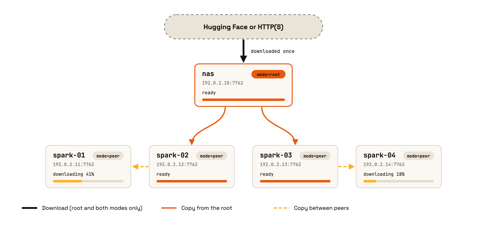
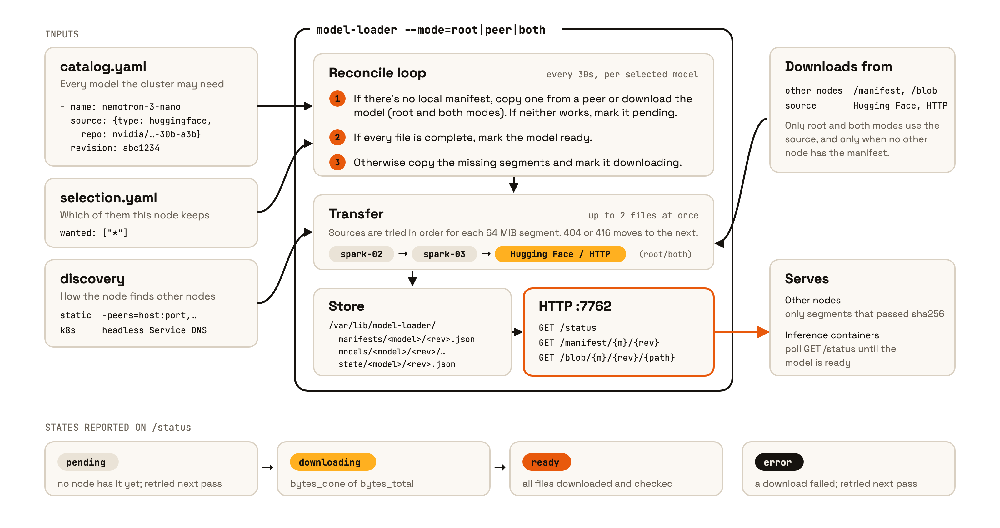
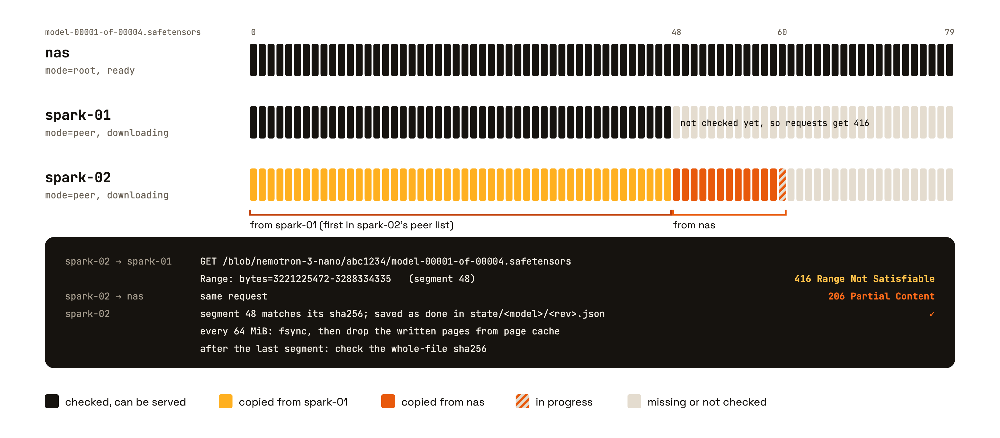

# model-loader

Downloads large model files once and copies them to every machine on your
network. A node that is only serving files it already has uses very little
memory.

<picture>
  <source media="(prefers-color-scheme: dark)" srcset="docs/img/fleet-dark.png">
  
</picture>

Every node runs the same binary. `--mode` sets what it does:

- **root** downloads catalog models from their source (Hugging Face or plain
  HTTP) into its local store.
- **peer** copies missing files from other nodes, either the root or another
  peer. It doesn't need internet access.
- **both** does both. Use this on a single machine.

Every node serves the files it has to the other nodes, so peers can copy from
each other instead of all copying from the root.

<picture>
  <source media="(prefers-color-scheme: dark)" srcset="docs/img/node-dark.png">
  
</picture>

Files are transferred in 64 MiB segments. Each segment is checked against the
sha256 in the manifest before it's marked done or served to other nodes.

<picture>
  <source media="(prefers-color-scheme: dark)" srcset="docs/img/segments-dark.png">
  
</picture>

See [docs/design.md](docs/design.md) for the full design and
[docs/protocol.md](docs/protocol.md) for the wire format.

## Status

Core packages, CLI, and all three deploy targets (k8s, docker compose,
spark-os) are in place and tested. Not yet run against a real model catalog
end-to-end.

## Releases

Pushing a `v*` tag runs `.github/workflows/release.yml`, which publishes:

- `ghcr.io/kindlingai/model-loader:<version>` for linux/amd64 and
  linux/arm64 (and `:latest` for versions without a `-suffix`). The binary is
  at `/usr/local/bin/model-loader`.
- A GitHub release with `model-loader_<version>_linux_{amd64,arm64}.tar.gz`
  and `SHA256SUMS`.

`model-loader -version` prints the version the binary was built from.

## Layout

```
cmd/model-loader/   CLI entrypoint
internal/catalog/   desired-state parsing (catalog.yaml)
internal/store/     local content store, manifests, integrity
internal/source/    download sources (http, huggingface)
internal/transfer/  resumable range-fetch engine
internal/discovery/ peer discovery backends (static, k8s DNS)
internal/server/    LAN-facing HTTP server (status/manifest/blob)
internal/daemon/    reconcile loop tying it together
deploy/k8s/         Kustomize manifests
deploy/compose/     docker-compose.yml
deploy/spark-os/    systemd unit + env template for kindling-spark-os
```
